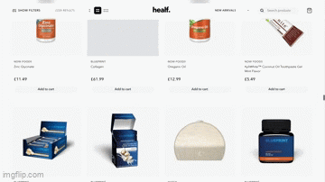

# Product Search Platform

A high-performance, production-ready product search platform optimized for handling large datasets (5k+ products) entirely on the client-side. This platform features a modern e-commerce interface with sliding sidebar filters, real-time search, and a comprehensive cart system.



## 🚀 Setup and Installation

### Prerequisites
- Node.js (v18.x or higher)
- npm or yarn

### Installation Steps
1. **Clone the repository** (or download source)
2. **Install dependencies**:
   ```bash
   npm install
   ```
3. **Run the development server**:
   ```bash
   npm run dev
   ```
4. **Run Tests**:
   - Logic/Unit tests: `npm run test`
   - UI/E2E tests: `npm run test:e2e`
5. **Access the application**:
   Open [http://localhost:3000](http://localhost:3000) in your browser.

## 🔗 Live Demo

The application is deployed and available at:
**[https://product-search-platform-zeta.vercel.app/](https://product-search-platform-zeta.vercel.app/)**

## �� Search Implementation

The search engine is optimized for speed and relevance, implemented entirely in TypeScript without external search dependencies (like Algolia or Elasticsearch).

- **Weighted Multi-Field Search**: Scores are calculated based on matches in `title` (weight: 3.0), `vendor` (2.0), `description` (1.0), and `tags` (0.5).
- **Matching Strategies**:
  - **Exact Match**: Highest priority.
  - **Prefix Match**: Matches tokens starting with the query.
  - **Word Boundaries**: Matches tokens within the text.
  - **Fuzzy Subsequence**: Handles minor typos and partial matches for tokens >= 3 chars.
- **Normalization**: All text and queries are normalized (lowercase, whitespace trimmed) to ensure consistent matching.

## ⚡ Performance Considerations

Building a performant search over a 50MB+ CSV file with 800k+ rows (filtered down to ~20k active products) required several critical optimizations:

- **Streaming CSV Parser**: Uses Papa Parse to stream and parse data without blocking the main thread.
- **Skeleton Grid & Progress tracking**: Instead of a simple loading spinner, users see a skeleton grid approximating the store's layout with a real-time progress bar as the dataset is scanned and parsed.
- **Memoized Results**: Search and filtering results are memoized using React's `useMemo` to prevent redundant computations during UI updates.
- **Debounced Processing**: Search execution is debounced by 300ms to ensure smooth typing even as the search engine processes thousands of records.
- **Early Termination**: The search engine uses efficient loops and early exits for filtered products that don't meet minimum relevance thresholds.

## 🎨 UI/UX Decisions

- **Floating Pill Header**: A modern, clean navigation bar with a backdrop blur effect that houses the logo, sorting dropdown, search bar (desktop), and cart.
- **Sliding Filter Sidebar**: Moves secondary controls (filters) into a dedicated side panel to maximize screen real estate for product imagery.
- **Responsive Navigation**: On mobile, the search bar moves from the header into the filter sidebar to reduce header congestion.
- **Consistent Interactivity**: All primary interactive elements (Sort, Filter, Cart) use a consistent "rounded pill" hover effect for visual feedback.
- **Dynamic Grid Layouts**: Users can customize their viewing experience with a grid layout switcher (2, 4, or 6 columns) located in the header, optimized for different screen sizes and density preferences.
- **Scroll Management**: The application automatically scrolls to the top when filters, search terms, or sorting options change, ensuring users see the most relevant results immediately.

## ✨ Feature Enhancements

- **Comprehensive Cart System**: Slide-out cart modal with quantity management, subtotal calculation, and a stylized checkout interface with payment provider icons.
- **Persistent Cart**: Your shopping cart is automatically saved to your browser's local storage, so items remain even after refreshing the page.
- **URL State Synchronization**: Search queries, active filters, and sorting options are reflected in the URL. Users can bookmark specific results and use the browser's back/forward buttons to navigate their search history.
- **Infinite Scroll**: Seamlessly browse through thousands of products with automatic loading as you scroll, replacing manual pagination for a smoother experience.
- **Search Term Highlighting**: Matches in product titles and brand names are visually highlighted, helping you scan for relevance and find what you're looking for faster.
- **Advanced Sorting**:
  - **New Arrivals**: The default view, sorting products by their creation date (newest first).
  - **Brand A-Z/Z-A**: Intuitive vendor-based sorting.
  - **Price/Rating**: Standard e-commerce sorting options.
- **Filtered Zero-Price Products**: Automatically hides products with £0 prices to ensure a high-quality product feed.
- **Brand Search**: Integrated search within the filter sidebar to quickly find specific vendors among hundreds.
- **Search Transparency Badges**: When a product matches based on hidden fields (like descriptions or tags), the UI displays a badge explaining the match, ensuring search results are intuitive even when the query isn't in the title.
- **Accessibility First**: Built with inclusive design in mind, featuring semantic landmark regions, `aria-live` announcements for search results, and robust keyboard navigation/focus management for modals and sidebars.

## 🧪 Testing Strategy

The platform includes a comprehensive testing suite to ensure stability across features:

- **Logic & Unit Tests (Vitest)**: Validates the search engine's weighted scoring, normalization, and tokenization logic. Examples found in `__tests__/searchEngine.test.ts`.
- **Component Tests (React Testing Library)**: Ensures UI components like `FilterSidebar` respond correctly to user interactions and maintain accessibility standards.
- **End-to-End Tests (Playwright)**: Simulates real user flows in a browser, including opening filters, searching, and verifying UI responsiveness. Run these using `npm run test:e2e`.

## 🛠️ Technical Trade-offs

- **Frontend vs. Backend Parsing**: We chose to parse the CSV on the client side to eliminate the need for a server/database. While this increases initial load time (2-5s), it makes every subsequent interaction (search, sort, filter) instant (~50ms).
- **TSV Compatibility**: The parser is optimized for Tab-Separated Values (TSV) to better handle high-density product descriptions that often contain commas or HTML.
- **Memory vs. Latency**: The entire active dataset is kept in memory. While this consumes more RAM (~100MB), it results in sub-millisecond response times for client-side filtering.

## 📝 Assumptions and Limitations

- **Static Data**: The application assumes the `data.csv` is updated periodically via a build process rather than requiring real-time inventory sync.
- **Memory Limits**: Performance is optimal for up to ~100k active products in a browser environment. Beyond this, a move to indexedDB or a server-side search (Meilisearch) would be recommended.
- **Browser Compatibility**: Requires modern browsers supporting ES6+ features and Web Streams API.
